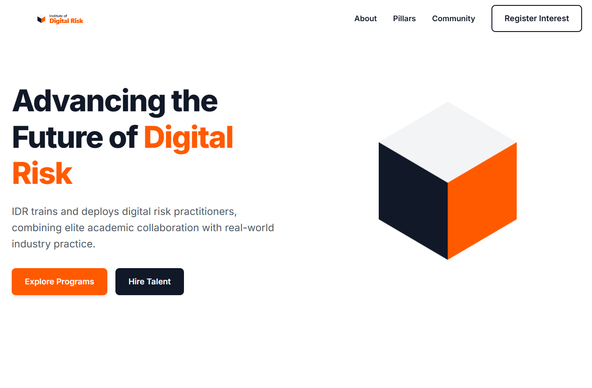

# Institute of Digital Risk (IDR) – Homepage Design 🚀

A modern, responsive homepage designed for an industry-focused institute working in digital, cyber, and AI risk.  
The goal was to create a clean, structured, and trustworthy interface that clearly communicates the institute’s mission and offerings.

---

## 🌐 Live Demo

👉 https://tushargupta-008.github.io/Institute-of-Digital-Risk/

---

## 📸 Preview

---

## ✨ Features

- Clean and modern landing page UI
- Strong hero section with clear messaging
- Call-to-action focused design (Explore Programs, Hire Talent)
- Sticky navigation for smooth user experience
- Section-based layout (About, Pillars, Community, CTA)
- Fully responsive across devices

---

## 🛠️ Tech Stack

- HTML5 (semantic structure)
- CSS3 (Flexbox + responsive design)
- Vanilla JavaScript (basic interactions)
- Google Fonts

---

## 🎯 What I Focused On

- Designing for clarity and trust (important for institutional websites)
- Creating strong call-to-action flow for user engagement
- Maintaining clean visual hierarchy
- Ensuring responsiveness across different screen sizes
- Keeping UI minimal yet impactful

---

## 💡 Key Learning

- Structuring landing pages for real-world use cases  
- Improving UI/UX through spacing, typography, and layout  
- Understanding how design impacts user navigation  
- Building responsive layouts without frameworks  

---

## 👨‍💻 Author

Tushar Gupta
